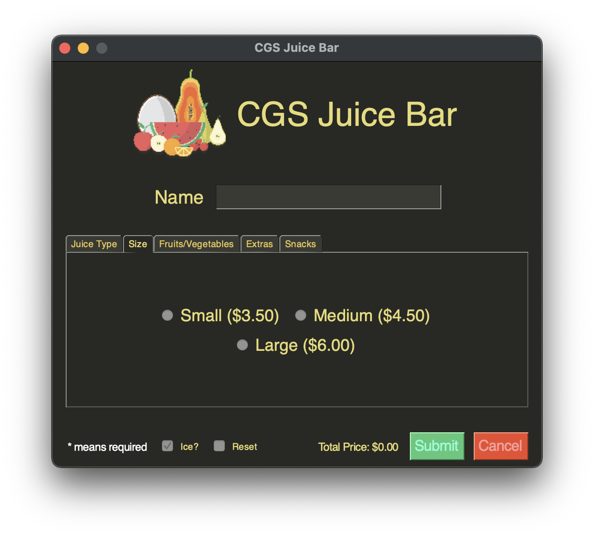

# Test Table for the CGS Juice Bar

## Code

### Input Dictionaries
```python
choices_dict = {
    'fruit_vegetable': [['Apple', 'Pineapple', 'Banana'],
                        ['Strawberry', 'Orange', 'Spinach'],
                        ['Cucumber', 'Beetroot', 'Carrot']],
    'sizes': [['Small ($3.50)', 'Medium ($4.50)'], ['Large ($6.00)']],
    'juice_type': [['Apple', 'Tropical'],
                   ['Orange', 'Pineapple']],
    'extras': [['Ginger', 'Honey', 'Muesli'],
               ['Chia', 'Seeds']],
    'snacks': [['Hazelnut Protein Balls\n4 for $5.50', 'Chocolate Brownies\n1 for $3.50'],
               ['Almond Energy Bites\n4 for $4.50', 'Passion Fruit Muesli Bar\n1 for $3.25']]
}

category_name_dict = {
    'fruit_vegetable': 'Fruits/Vegetables',
    'sizes': 'Size',
    'juice_type': 'Juice Type',
    'extras': 'Extras',
    'snacks': 'Snacks'
}
```

### Tab Layout
```python
get_tab_layout(
    name='juice_type',
    frame_layout=[
        [
            sg.Radio(
                choice, size=(10, 1), font=('Helvetica', 18),
                key='juice_type' + choice, group_id='juice_type', enable_events=True
            ) for choice
            in array
        ] for array in choices_dict['juice_type']
    ]
)
```

## Test Table

| Test Case                | Test Data                                                                                | Expected Result                                                                                                                                                                                      | Actual Result                                                                                     |
|--------------------------|------------------------------------------------------------------------------------------|------------------------------------------------------------------------------------------------------------------------------------------------------------------------------------------------------|---------------------------------------------------------------------------------------------------|
| tabs                     | see input dictionaries above                                                             | the program should render all tabs with the specified tab names, as well as the options from the choices dict                                                                                        |                                                      |
| tab_layout               | see tab layout above                                                                     | given the specific sg function, the tab_layout function should create and center each frame inside the tab                                                                                           | </br> |
| limit_checkbox_selection | the 4 selected checkboxes by the user                                                    | the function (which is run every time an even runs) should disable all non-selected checkboxes to limit the selection to 4                                                                           |                                                      |
| limit_checkbox_selection | the user selects 4 checkboxes and then deselects one                                     | the function should then re-enable all checkboxes, as the limit of 4 is no longer hit                                                                                                                |                                                      |
| submit_clicked           | the checkboxes and radio buttons that the user has inputted                              | the program should have a popup with the user's name, telling them what their order is, as well as the total price                                                                                   |                                                      |
| submit_clicked           | the user has not filled out their name                                                   | the program should have a little error message in the bottom left corner, telling them that they need to enter a name if they click the submit button                                                |                                                      |
| submit_clicked           | the user has not selected a juice type                                                   | the program should have a little error message in the bottom left corner, telling them that they need to enter a juice type if they click the submit button                                          |                                                      |
| submit_clicked           | the user has not selected a size                                                         | the program should have a little error message in the bottom left corner, telling them that they need to enter a size if they click the submit button                                                |                                                      |
| submit_clicked           | the selected inputs by the user, in this case, tropical + small, which should cost $3.50 | the program should calculate the correct cost and display it on the popup                                                                                                                            |                                                      |
| count_total_price        | the selected radios and checkboxes by the user                                           | each time a new radio is selected, the program should calculate the price live and then update the screen with the calculated price                                                                  |                                                    |
| layout                   | user receives an error                                                                   | the window should stay the same size and still look good even with elements changing size                                                                                                            |                                                    |
| reset_checkbox           | reset checkbox is clicked                                                                | everything should reset to the same state the window was created in, should not break anything, such as: </br>the name not clearing, the price not updating, or the disabled checkboxes not updating |                                                    |
| submission_popup         | no fruits or vegetables are selected                                                     | the frame for this category does not show up on the submission popup, instead it is skipped                                                                                                          |                                                    |
| submit button            | the user spams the submit button many times                                              | the program should work the same, giving them the same error if an error occurred, or not creating more popups if one already exists                                                                 |                                                    |
