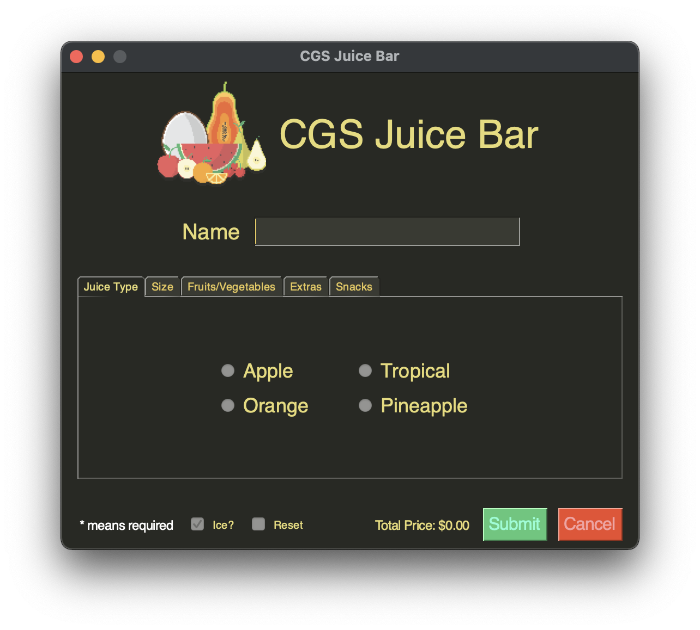
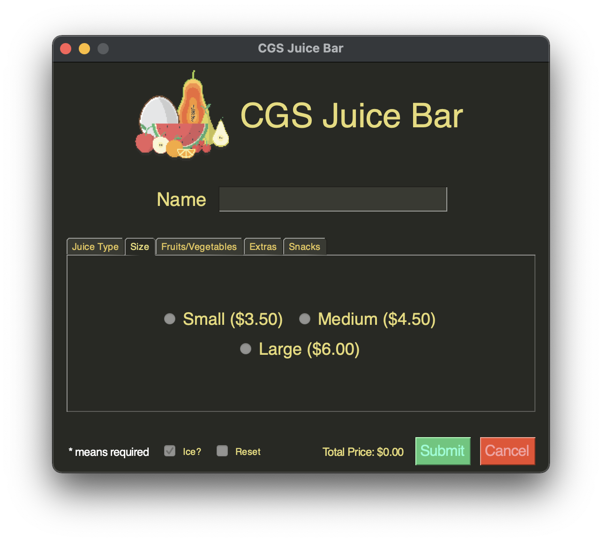
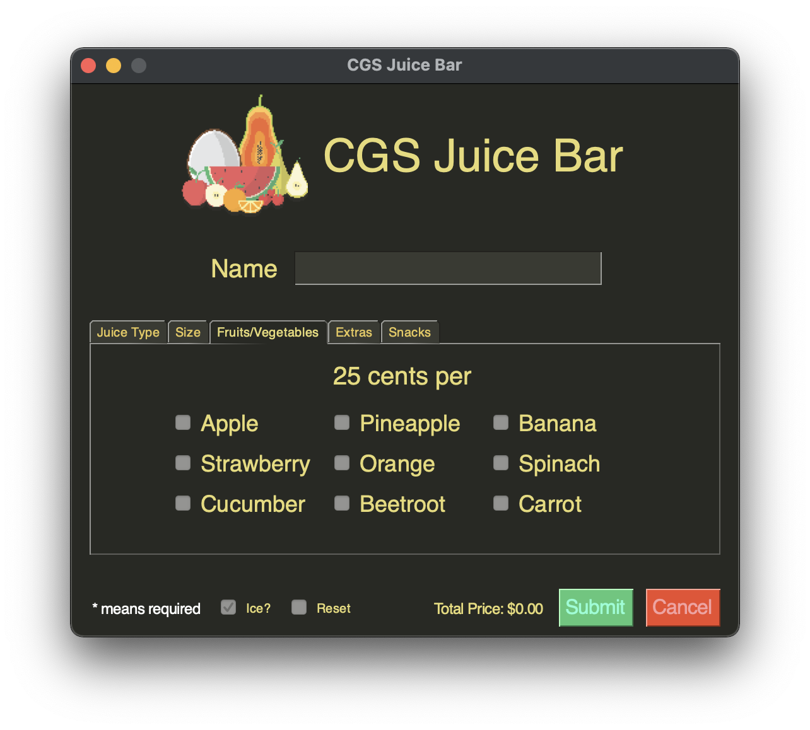
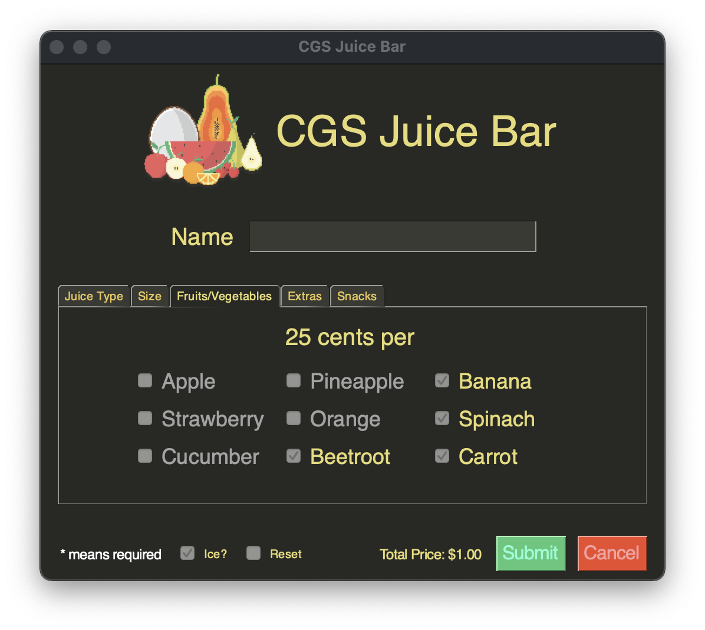
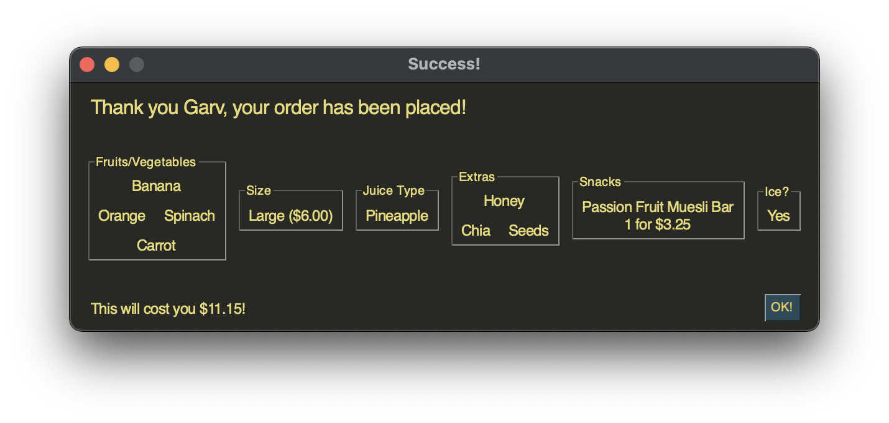
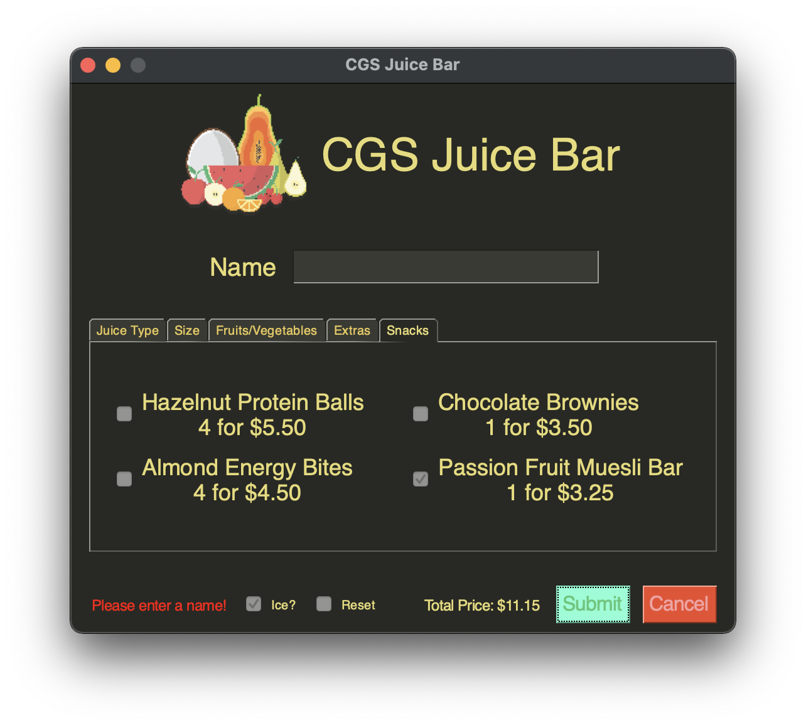
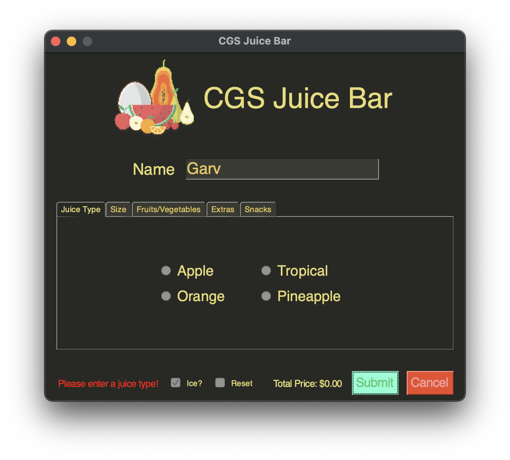

# Test Table for the CGS Juice Bar

## Code

### Input Dictionaries
```python
choices_dict = {
    'fruit_vegetable': [['Apple', 'Pineapple', 'Banana'],
                        ['Strawberry', 'Orange', 'Spinach'],
                        ['Cucumber', 'Beetroot', 'Carrot']],
    'sizes': [['Small ($3.50)', 'Medium ($4.50)'], ['Large ($6.00)']],
    'juice_type': [['Apple', 'Tropical'],
                   ['Orange', 'Pineapple']],
    'extras': [['Ginger', 'Honey', 'Muesli'],
               ['Chia', 'Seeds']],
    'snacks': [['Hazelnut Protein Balls\n4 for $5.50', 'Chocolate Brownies\n1 for $3.50'],
               ['Almond Energy Bites\n4 for $4.50', 'Passion Fruit Muesli Bar\n1 for $3.25']]
}

category_name_dict = {
    'fruit_vegetable': 'Fruits/Vegetables',
    'sizes': 'Size',
    'juice_type': 'Juice Type',
    'extras': 'Extras',
    'snacks': 'Snacks'
}
```

### Tab Layout
```python
get_tab_layout(
    name='juice_type',
    frame_layout=[
        [
            sg.Radio(
                choice, size=(10, 1), font=('Helvetica', 18),
                key='juice_type' + choice, group_id='juice_type', enable_events=True
            ) for choice
            in array
        ] for array in choices_dict['juice_type']
    ]
)
```

## Test Table

| Test Case                                          | Test Data                                                                                                                                                                         | Expected Result                                                                                                                           | Actual Result                                                                                     |
|----------------------------------------------------|-----------------------------------------------------------------------------------------------------------------------------------------------------------------------------------|-------------------------------------------------------------------------------------------------------------------------------------------|---------------------------------------------------------------------------------------------------|
| tabs                                               | see input dictionaries above                                                                                                                                                      | the program should render all tabs with the specified tab names, as well as the options from the choices dict                             |                                                      |
| tab_layout                                         | see tab layout above                                                                                                                                                              | given the specific sg function, the tab_layout function should create and center each frame inside the tab                                | </br> |
| limit_checkbox_selection                           | the 4 selected checkboxes by the user                                                                                                                                             | the function (which is run every time an even runs) should disable all non-selected checkboxes to limit the selection to 4                |                                                      |
| limit_checkbox_selection                           | the user selects 4 checkboxes and then deselects one                                                                                                                              | the function should then re-enable all checkboxes, as the limit of 4 is no longer hit                                                     |                                                      |
| input.csv                                          | the user may be manually typing out their csv file and forget to add a header, such as 'answer'. alternatively, they may make a typo, causing the file to not be parsed correctly | the program should tell the user that the headers are not correct and that there are specific headers required for the program to work    |                                                      |
| input.csv                                          | the provided csv file may have the correct headers but not contain any questions                                                                                                  | the program should tell the user that the csv file they've supplied does not include any questions, and they have to add them to continue |                                                      |
| input.csv                                          | there might not be any csv file in the local directory, causing the question list to be empty                                                                                     | the program should tell the user that no file was found, and for the program to work there must be a csv file with questions              |                                                      |
| topic                                              | the input topic that the user selects may not be a valid topic, in this case "science"                                                                                            | the program should tell the user that what they selected is not a valid topic, and keep asking them until they select a valid one         |                                                      |
| user_answer                                        | the user might type out there answer instead of choosing a letter, in this case "84"                                                                                              | the program should tell the user that the answer has to be a, b, c or d and keep prompting them until they give a valid response          |                                                      |
| input.csv                                          | the file is moved while the user is answering questions                                                                                                                           | the program should work like normal                                                                                                       |                                                    |
| input("Would you like to filter by topic? (y/n) ") | the user may type yes to this question instead of typing y or n as instructed                                                                                                     | the program should still take it as a yes                                                                                                 |                                                    |
| user_filter                                        | the user may type yes to this question instead of typing y or n as instructed                                                                                                     | the program should still take it as a yes                                                                                                 |                                                    |
| user_filter                                        | the user may type no to this question instead of typing y or n as instructed                                                                                                      | the program should still take it as a no                                                                                                  |                                                    |
