| Test Case                                          | Test Data                                                                                                                                                                         | Expected Result                                                                                                                           | Actual Result                                   |
|----------------------------------------------------|-----------------------------------------------------------------------------------------------------------------------------------------------------------------------------------|-------------------------------------------------------------------------------------------------------------------------------------------|-------------------------------------------------|
| input.csv                                          | renaming the csv file to wee.csv                                                                                                                                                  | the program should continue working as expected, as the file is fetched by its extension (.csv), not its name                             | 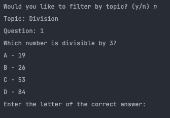   |
| input.csv                                          | when creating the csv file, the user accidentally forgets a field, in this case lacking the answer to the first question                                                          | The program should tell the user that they've missed a field and tell them where they missed it so they can add it back                   | 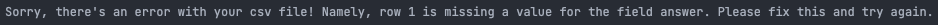   |
| input.csv                                          | the user may accidentally put the actual answer in the answer field instead of a, b, c or d. In this case, the second question has the answer written as "Seventy" instead of B   | the program should tell the user where the error occurred and that the answer field has to be a, b, c or d                                | 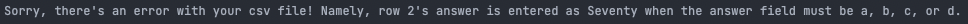   |
| input.csv                                          | the user may be manually typing out their csv file and forget to add a header, such as 'answer'. alternatively, they may make a typo, causing the file to not be parsed correctly | the program should tell the user that the headers are not correct and that there are specific headers required for the program to work    | 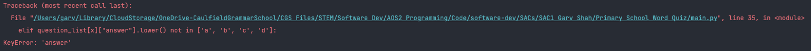   |
| input.csv                                          | the user may be manually typing out their csv file and forget to add a header, such as 'answer'. alternatively, they may make a typo, causing the file to not be parsed correctly | the program should tell the user that the headers are not correct and that there are specific headers required for the program to work    |    |
| input.csv                                          | the provided csv file may have the correct headers but not contain any questions                                                                                                  | the program should tell the user that the csv file they've supplied does not include any questions, and they have to add them to continue | 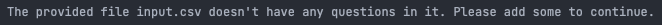   |
| input.csv                                          | there might not be any csv file in the local directory, causing the question list to be empty                                                                                     | the program should tell the user that no file was found, and for the program to work there must be a csv file with questions              | 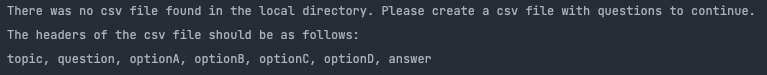   |
| topic                                              | the input topic that the user selects may not be a valid topic, in this case "science"                                                                                            | the program should tell the user that what they selected is not a valid topic, and keep asking them until they select a valid one         | 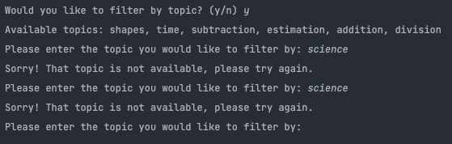   |
| user_answer                                        | the user might type out there answer instead of choosing a letter, in this case "84"                                                                                              | the program should tell the user that the answer has to be a, b, c or d and keep prompting them until they give a valid response          | 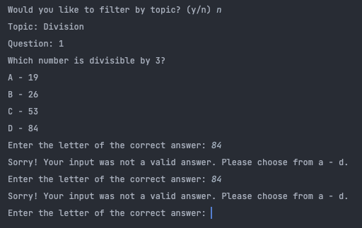   |
| input.csv                                          | the file is moved while the user is answering questions                                                                                                                           | the program should work like normal                                                                                                       | 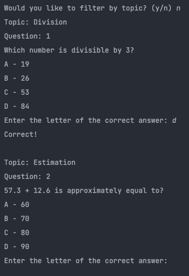 |
| input("Would you like to filter by topic? (y/n) ") | the user may type yes to this question instead of typing y or n as instructed                                                                                                     | the program should still take it as a yes                                                                                                 | 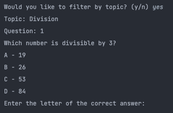 |
| user_filter                                        | the user may type yes to this question instead of typing y or n as instructed                                                                                                     | the program should still take it as a yes                                                                                                 | 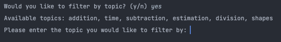 |
| user_filter                                        | the user may type no to this question instead of typing y or n as instructed                                                                                                      | the program should still take it as a no                                                                                                  | 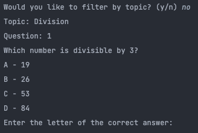 |
