# Test Table for Word Match

| Test Case               | Test Data                                                                      | Expected Result                                                                                                                                      | Actual Result                                   |
|-------------------------|--------------------------------------------------------------------------------|------------------------------------------------------------------------------------------------------------------------------------------------------|-------------------------------------------------|
| words.txt               | no words in text file                                                          | no matching words found                                                                                                                              | 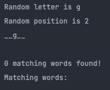   |
| random_number           | random number is between 0 - 5 instead of 0 - 4                                | If the number selected is 5, a IndexError is thrown                                                                                                  | 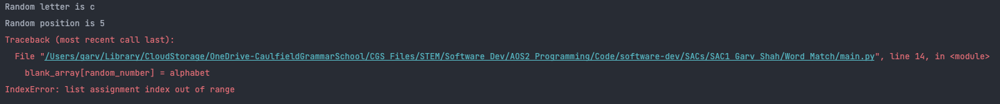   |
| random_number, alphabet | the number 2 is chosen with the alphabet b                                     | all numbers that have b in the their third position are displayed                                                                                    |    |
| words.txt               | there is no text file in the local directory/it has a different name           | a file not found error is thrown                                                                                                                     | 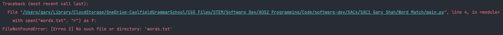   |
| print statement         | if the end="" is taken away on line 27                                         | the words will still print, just with a extra linebreak between them                                                                                 | 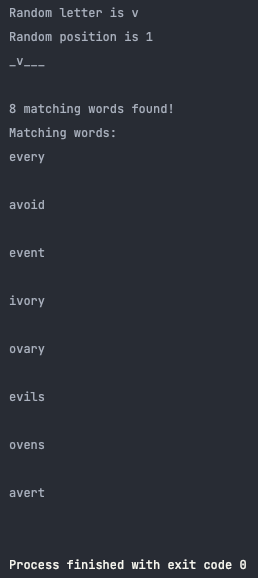   |
| blank_array             | if the range for the blank array is set to 10 instead of 5                     | it would put the random letter in the correct position, just with 5 more underscores afterwards                                                      | 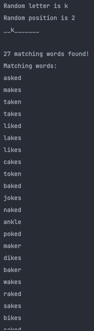   |
| words.txt               | the file has a different name, for example 'input.txt'                         | it works the same, regardless of file name                                                                                                           | 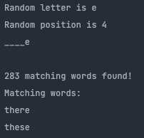   |
| words.txt               | the file is in a different directory or doesn't exist                          | the program just continues and treats it as if the word list was empty                                                                               | 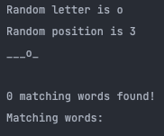   |
| words.txt               | there are multiple text files in the local directory (+aa.txt, which is empty) | the program selects the first one it finds, aa.txt                                                                                                   | 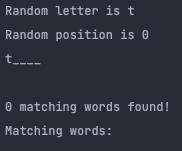   |
| words.txt               | the lines are 6 letter long words instead of 5                                 | the program treats them as 5 letter words, just printing out the final 6 letter word but not being able to interact with the final character         | 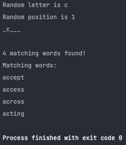 |
| words.txt               | the lines are 6 letter long words instead of 5                                 | the program tells the user that the file format is incorrect, and continuing could break things, giving them the option to continue                  | 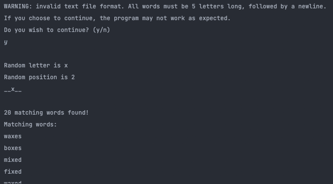 |
| words.txt               | the words are in japanese with non-english characters                          | similarly, it gives a warning, and it should find no matches                                                                                         | 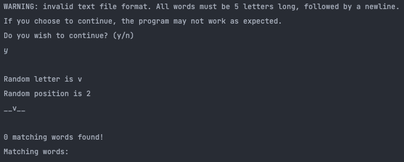 |
| words.txt               | the words have less than 5 letters in them                                     | it should throw an index error                                                                                                                       | 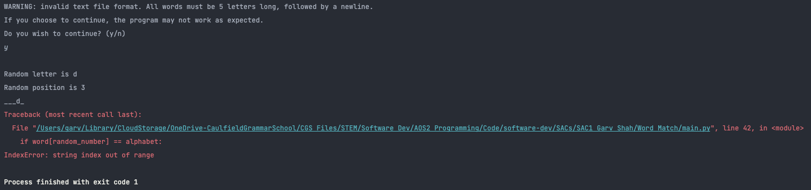 |
| words.txt               | the words have more than 5 letters in them                                     | for each word it iterates through that has too few characters, it prints an error, but as the user has asked it continue, it tries its best to do so | 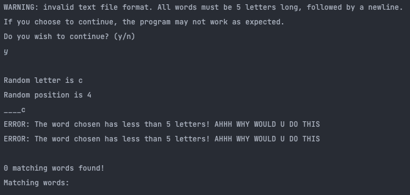 |