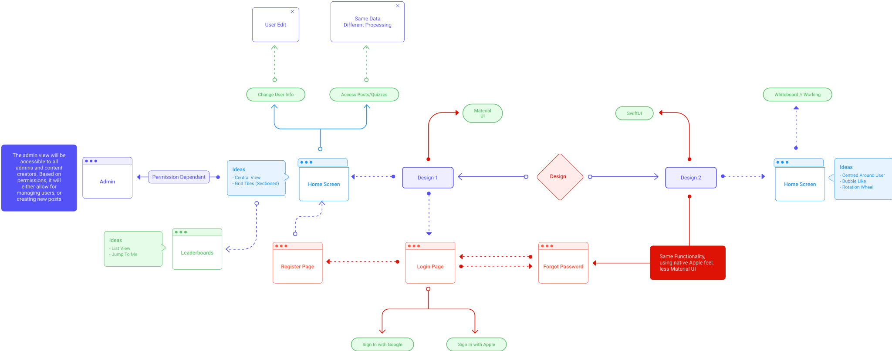
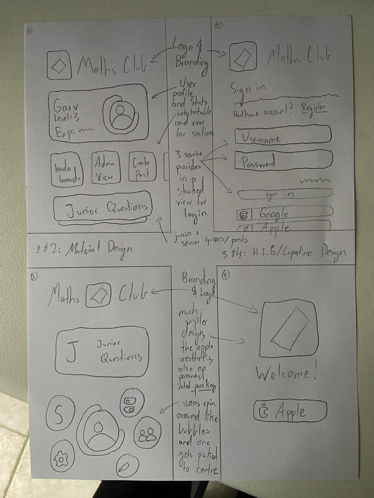

# Design

Created: June 1, 2022 6:34 PM
Tags: Design

# Mindmap & Sketches

As seen [here](https://www.figma.com/file/hSCNWSQjN0u1gY1C8XkxJo/Design-Mind-Map?node-id=245%3A1064) or in the image
above, a mindmap of two possible design ideas was created, one following the Material Design standard by Google, and the
other following the Human Interface Guidelines by Apple (also known as the Cupertino Design System). Both designs have
very similar functionality, but with varying differences in appearance, look and feel.

As seen from the small sketches above, both designs have a different way of expressing user information. The Material
Design (1/2) envision has a lot more information readily available, and would most-likely be easier to develop, while
the Cupertino Design (3/4) has a much simpler, cleaner interface, but at the same time would probably be more difficult
to program. Specifically, the Material Design follows a conventional grid like pattern, while the Cupertino Design, at
least for the home page has a bubbly and friendly aesthetic with supposedly bright vivid system colours, that float and
spin around the user icon, and when one of these spinning circles is clicked, it would move to the top to be in focus,
telling the user what the functionality is. The Material Design would more so simply express these to the user by having
a few scroll options being a more packed UI. Both designs feature large buttons with big clickable spaces, not only to
seem more friendly but also for accessibility purposes, which would be better for blind users. Branding is also features
across the designs to build a brand identity with the logo. Though not shown in the sketches due to a lack of colour, a
purple accent will be prevalent throughout, representing academics, professionality, creativity and friendliness.

# Evaluation Criteria

As is with all designs, a clear set of evaluation criteria need to be defined so that one design can be selected over
the other. Taking inspiration from the SRS document, a list of requirements has been defined that we want the pertaining
to the design:

### Usability

- Be fast and intuitive to use, without too much explanation, meaning it shouldn’t be overwhelming for the average maths
  club user and should not be overboard
- Not be extremely complicated, and get the job done in a time-effective manner, both for the programmer and the
  client (also comes under feasibility)
- Be accessible for the target audience

### Portability

- Be able to work on the selected platforms, namely as a website, MacOS, iOS/iPadOS and Android

### Maintainability

- Have a consistent design framework that can be followed to expand the application in the future

### Feasibility

- Be within the technical expertise of the developer
- Should be able to implement the architecture outlined in the SRS

Though these evaluation criteria are pretty simple, they should comprehensively allow the evaluation of the efficiency
and effectiveness of a design, and by extension the software solution it will produce.

### Cupertino (Apple) Design

With the Cupertino Design, it is produced in a way where using the software should be intuitive. There isn’t too much
UI, so it shouldn’t be too overwhelming for the user, and this makes it good in a way that it should feel clean and
professional no matter what. The rotating bubbles make it seem friendly but apt, and it shouldn’t be overwhelming. Being
fast is another issue entirely though. Even though it may be simple to use and intuitive at a first glance, it does
introduce a few additional clicks of having to expand the bubble to click on it, and with the transitions planned, the
usability may be compromised by speed, namely impacting portability (legacy devices would not be supported). This may
make the design a bit tiresome for regular users.

This is where the second evaluation criteria comes in, in that it may be a bit complicated to produce, and though it
will be fine for the client, it probably verges on being outside the scope of the project the developer's ability. Since
the transitions and layout are not standard for a mobile app, using new advanced technologies such as Passkeys, it may
take longer to develop compared to the Material Design.

The main problem here arises with the ability to work on all desired platforms for the target audience. Designs do not
reflect deployability strictly, yes, but they do influence feasibility, and it is probably not feasible to create an app
following an Apple design standard on non-Apple devices, due simply to how closed their platforms can be. Material is an
open design standard, the Human Interface Guidelines are not. Though Cupertino can be followed in Flutter, it generally
has a lot less support and would be a harder development experience altogether, since Flutter is created by Google,
meaning it would simply be a worse experience as a developer, and for people on non-Apple devices to use the application
if it was created with this design. This being said, the accessibility on Apple devices for such an application would be
ideal, as the app is integrated with the system. This would be ideal for disabled users, but also for the general user
and using the app in the way they would like. This could include following system font choices by the user, working with
system apps like Spotlight and Siri, or simply providing a more accessible user experience, so everyone can use the app.

Both of the designs offer consistent frameworks with widely adopted design standards, so that shouldn’t be too much of a
problem, but this design is probably less within the technical expertise of the developer since they have more
experience working with the Material Design standard with other applications in the past, compared to H.I.G. It also
offers some somewhat complicated functionality that they would not immediately know how to implement.

Finally, both designs seem to be able to implement the architecture outlined in the SRS quite effectively, as any modern
frameworks should be able to do on capable hardware (not running on specialised hardware such as a fridge or watch).

## Material Design

The downside of the Material Design is that it may not be as intuitive to use right off the bat. It will probably make
sense after some getting used to, but without any experience it might feel overwhelming due to all the elements on
screen. This has the opposite problem to the Cupertino Design, as it becomes quite fast and intuitive after some time,
but may not be as “explanation-less” and elegant as the design above. Many scrollable sections and all the pages it
leads to could be a bit too much at the start, but it should feel nice and consistent for regular users, and be fast on
any device, including legacy ones, due to the stock-standard app it creates, not doing anything out of the box that may
decrease or take a toll on performance.

Similarly, with the evaluation criteria of not being too complicated, the Material Design is almost the opposite of
Cupertino, in that it might take a bit longer for the job to be done by the average user, but development times will be
significantly reduced, since the app is what is expected, and since it does not make too many stray turns in terms of
functionality outside the developer's capabilities, development time will be much shorter and streamlined. As such,
it better meets the scope of the project.

The main advantage of this design system is its great adoption within the Flutter ecosystem. Flutter is developed by
Google, Material is developed by Google, so both of them work quite seamlessly together to be able to create native
multiplatform apps that simply work. As such, this design should hold the advantage of offering an equal experience on
all platforms, and not being any faster or slower due to the operating system being worked on, simply working at a near
native speed. As such, this design provides an even experience to most users, at the compromise of not providing the
best experience to a subset of users. This leads into accessibility, where if this design is followed, it is more
accessible in that more people can access the app (due to portability) but is less accessible in that people with
certain needs that wouldn't be of the general userbase may not have access to platform accessibility features they would
have otherwise, as mentioned above.

As mentioned, both designs offer sufficient guidelines and frameworks that allow for the app to be extended in the
future with a consistent design, and this one has the advantage of being much more within the developer's expertise, as
even though they have gotten familiar with Apple frameworks recently, Flutter would still be ideal. Finally, as
mentioned, both designs should easily be able to have the capability to execute the architecture defined in the SRS, as
most modern frameworks would.

# Selected Design

After all of this, the design that was settled on was the Material Design. This was due to a variety of reasons, but
namely due to the ability to work better on the desired platforms, with the time constraint of this project for the
developer. As described above, even though the Material Design may be a bit less intuitive to use and may not
necessarily look as nice, one of the main needs for this app is the ability to work well on multiple platforms, which
includes platforms not created by Apple. Using the Cupertino Design would make all experiences not on Apple devices
significantly worse, so one of the main factors in selecting Material was that Flutter has much greater support for it,
allowing a near native experience on any platform, albeit slightly compromised. Accessibility, as discussed above is
overall better with the Material Design too, though both designs tackle a different kind of accessibility. Material also
offers large clickable buttons that will not only make the design more friendly but also better for those hard of sight.
Also, considering the time constraints as well as developer capability, it is much more feasible to create the
stock-standard mobile application compared to one with out of the box animations and ideas, especially when the
development cycle needs to be under 10 weeks. Even though it may be slightly overwhelming to the average user and may
not be as intuitive at the start, it can be assumed that these differences would be marginal enough that they can be
negated by the time saved on development, it is more important to have a functional app compared to an app that has
impressive transitions but no functionality at all.

As such, with reference to all the evaluation criteria above and by comparing and contrasting the two ideas, it has been
deemed more reasonable to go with the Material Design over the Cupertino Design.

# Wireframe/Mockup

After the considerations above, the following mockup was created of the Material Design, which serves as a finalised
version that should aid in development!

## Mockup:

[https://www.figma.com/proto/Ri7vDbiM1Rph5tl5wCsnbE/Maths-Club-Material-Design?page-id=0%3A1&node-id=1%3A2&viewport=442%2C452%2C0.39&scaling=scale-down&starting-point-node-id=1%3A2](https://www.figma.com/proto/Ri7vDbiM1Rph5tl5wCsnbE/Maths-Club-Material-Design?page-id=0%3A1&node-id=1%3A2&viewport=442%2C452%2C0.39&scaling=scale-down&starting-point-node-id=1%3A2)

## Wireframe:

