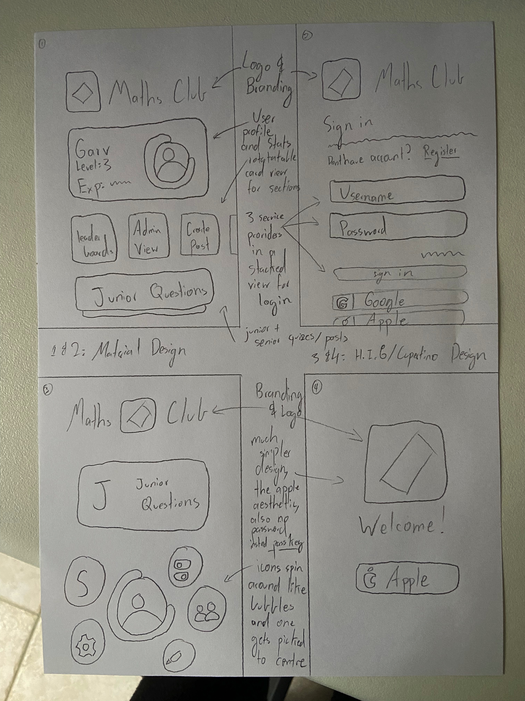

# Design

Created: June 1, 2022 6:34 PM
Tags: Design

# Mindmap & Sketches

As seen above [here](https://www.figma.com/file/hSCNWSQjN0u1gY1C8XkxJo/Design-Mind-Map?node-id=245%3A1064) or in the image above, I created a mindmap of two possible design ideas, one following the Material Design standard by Google, and the other following the Human Interface Guidelines by Apple. Both designs have very similar functionality, but with varying differences in appearance, look and feel.

As seen from the small sketches above, both designs have a different way of expressing user information. The Material Design (1/2) I envision has a lot more information readily available, and would probably be easier to program, while the Cupertino Design (3/4) has a much simpler cleaner interface, but at the same time would probably be more difficult to program. Specifically, the Material Design follows a conventional grid like pattern, while the Cupertino Design, at least for the home page has a bubbly and friendly aesthetic with supposedly bright vivid system colours, that float and spin around the user icon, and when one of these spinning circles is clicked, it would move to the top to be in focus, telling you what the functionality is. The Material Design would more so just express these to you by having a few scroll options, and is generally just a more packed UI.

# Evaluation Criteria

As is with all designs, a clear set of evaluation criteria need to be defined so that one design can be selected over the other. Taking inspiration from the SRS document, we can define a list of requirements that we want the software/design to be able to do:

- Be fast and intuitive to use, without too much explanation, meaning it shouldn’t be overwhelming for the average maths club user and should not be overboard
- Not be extremely complicated, and get the job done in a time-effective manner, both for the programmer and the client
- Be able to work on the selected platforms, namely as a website, MacOS, iOS/iPadOS and Android
- Have a consistent design framework that can be followed to expand the application in the future
- Be within the technical expertise of the developer, i.e. me
- Should be able to implement the architecture outlined in the SRS

Though these evaluation criteria are pretty simple, they should comprehensively allow us to evaluate the efficiency and effectiveness of a design, and by extension the software solution it will produce.

Let’s get started with the Cupertino Design:

## Cupertino (Apple) Design

With the Cupertino Design, it is produces in a way where using the software should just make sense. There isn’t too much UI, so it shouldn’t be too overwhelming for the user, and this makes it good in a way that it should feel clean and professional no matter what. The rotating bubbles make it seem friendly but apt, and it shouldn’t be overwhelming. Being fast is another issue entirely though. Even though it may be simple to use and intuitive at a first glance, it does introduce a few additional clicks of having to expand the bubble to click on it, and with the transitions planned, I’m not entirely sure how fast I would be able to make it on legacy devices that aren’t as fast as would be ideal. This may make the design a bit tiresome for regular users.

This is where the second evaluation criteria comes in, in that it may be a bit complicated to produce, and though it will be fine for the client, it probably verges on being outside of the scope of the project with my current capability. Since the transitions and layout are not your stock standard app, using new advanced technologies such as Passkeys, it may take longer for me to develop compared to the Material Design.

The main problem here arises with the ability to work on all desired platforms for the target audience. Designs do not reflect deployability strictly, yes, but they do influence feasibility, and it is probably not feasible to create an app following an Apple design standard on non-Apple devices, due simply to how closed their platforms can be. Material is an open design standard, the Human Interface Guidelines are not. Though Cupertino can be followed in Flutter, it generally has a lot less support and would be a harder development experience altogether, since Flutter is created by Google, meaning it would simply be a worse experience as a developer, and for people on non-Apple devices to use the application if it was created with this design.

Both of the designs offer consistent frameworks with widely adopted design standards, so that shouldn’t be too much of a problem, but this one is probably less within the technical expertise of me as a programmer since I am quite used to working with the Material Design standard with other applications I have made in the past, especially with Flutter. It also offers some somewhat complicated functionality that I would not know immediately how to implement.

Finally, both designs seem to be able to implement the architecture outlined in the SRS quite effectively, as any modern frameworks should be able to do on capable hardware (not running on a fridge or something).

## Material Design

The downside of the Material Design is that it may not be as intuitive to use right off the bat. It will probably make sense after some getting used to, but without any experience it might feel overwhelming due to all the things on screen. This has the opposite problem to the Cupertino Design, as it becomes quite fast and intuitive after some time, but may not be as “explanation-less” and elegant as the design above. Many scrollable sections and all the pages it leads to may be a bit too much at the start, but it should feel nice and consistent for regular users, and be fast on any device, including legacy ones, due to the stock standard app it creates, not doing anything too fancy that may decrease or take a toll on performance.

Similarly, with the evaluation criteria of not being too complicated, the Material Design is almost the opposite of Cupertino, in that it might take a tad longer for the job to be done by the average user, but development times will be significantly reduces, since the app is what is expected, and since it doesn’t make too many stray turns in terms of functionality I would have no clue on how to implement, development time will be much shorter and streamlined. As such, it better meets the scope of the project.

The main advantage of this design system is its great adoption within the Flutter ecosystem. Flutter is developed by Google, Material is developed by Google, so both of them work quite seamlessly together to be able to create native multiplatform apps that just work. As such, this design should hold the advantage of offering an equal experience on all platforms, and not being any faster or slower due to the operating system being worked on, simply working at a near native speed.

As mentioned, both designs offer pretty good guidelines and frameworks that allow for the app to be extended in the future with a consistent design, and this one has the advantage of being much more within my expertise, as even though I’ve gotten a lot more familiar with Apple frameworks recently, I would still say I have more experience in the world of Flutter. Finally, as mentioned, both designs should easily be able to have the capability to execute the outlines architecture defined in the SRS, as most modern frameworks would.

# Selected Design

After all of this, the design I settled on was the Material Design. This was due to a variety of reasons, but namely due to the ability to work better on the desired platforms, with the time constraint of this project for me, the developer. As described above, even though the Material Design may be a bit less intuitive to use and may not necessarily look as nice, one of the main needs for this app is the ability to work well on multiple platforms, which includes platforms not created by Apple. Using the Cupertino Design would make all experiences not on Apple devices significantly worse, so one of the main factors in selecting Material was that Flutter has much greater support for it, allowing a near native experience on any platform. Also, considering the time constraints as well as my capability as a developer, it is much more feasible to create the stock standard mobile application compared to one with out of the box animations and ideas, especially when the development cycle needs to be under a term. Even though it may be slightly overwhelming to the average user and may not be as intuitive at the start, I would guess that these differences would be marginal enough that they can be negated by the time saved on development, it is more important to have a functional app compared to an app that has cool transitions but no functionality at all.

As such, with reference to all the evaluation criteria above and by comparing and contrasting the two ideas, I have deemed it more reasonable to go with the Material Design over the Cupertino Design.

# Wireframe/Mockup

And with that, I produced the following mockup of the material design, which serves as a finalised version that should aid me development!

## Mockup:

[https://www.figma.com/proto/Ri7vDbiM1Rph5tl5wCsnbE/Maths-Club-Material-Design?page-id=0%3A1&node-id=1%3A2&viewport=442%2C452%2C0.39&scaling=scale-down&starting-point-node-id=1%3A2](https://www.figma.com/proto/Ri7vDbiM1Rph5tl5wCsnbE/Maths-Club-Material-Design?page-id=0%3A1&node-id=1%3A2&viewport=442%2C452%2C0.39&scaling=scale-down&starting-point-node-id=1%3A2)

## Wireframe:

